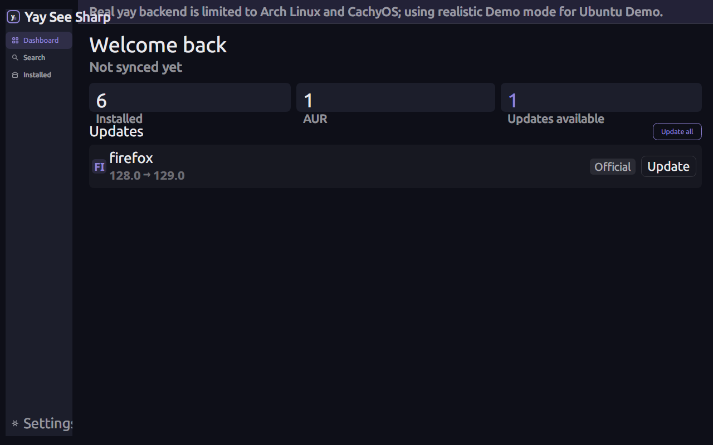
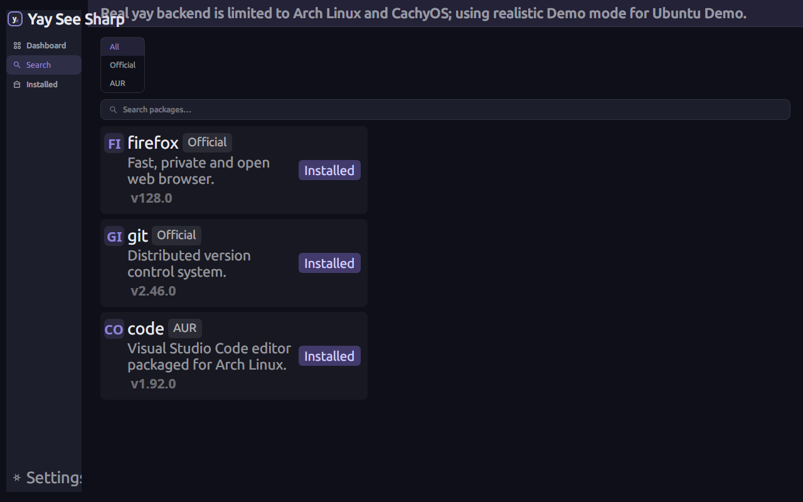
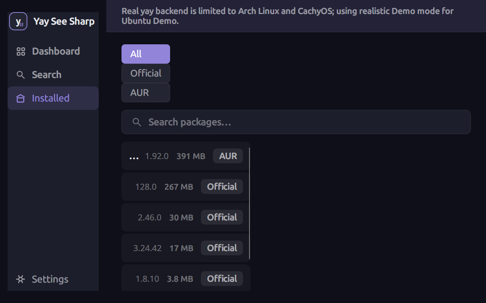
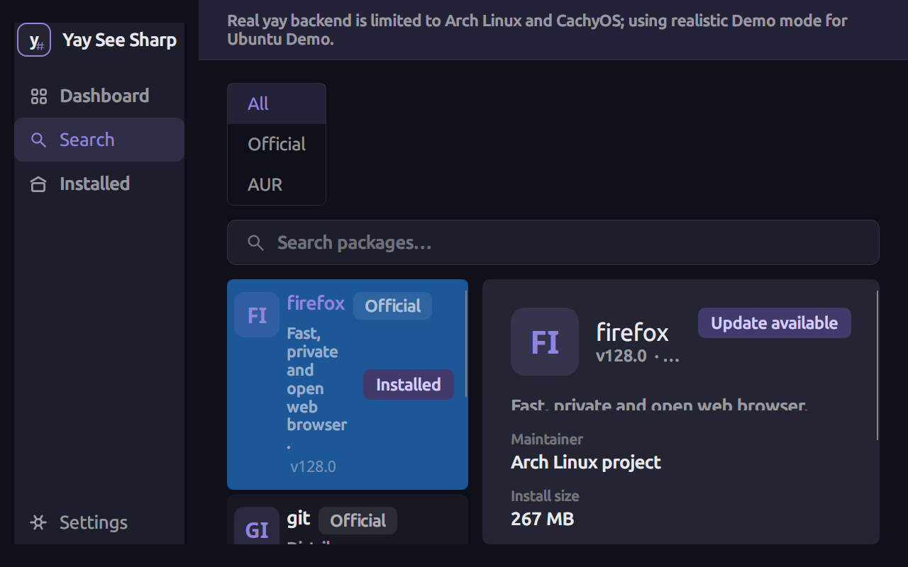
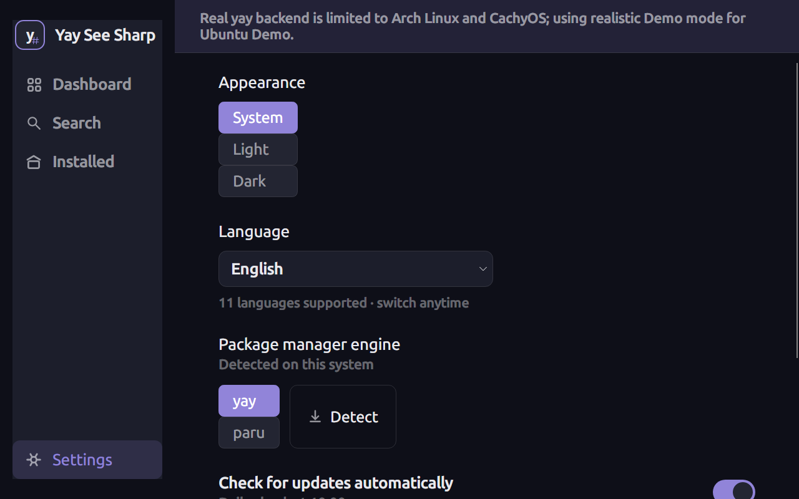
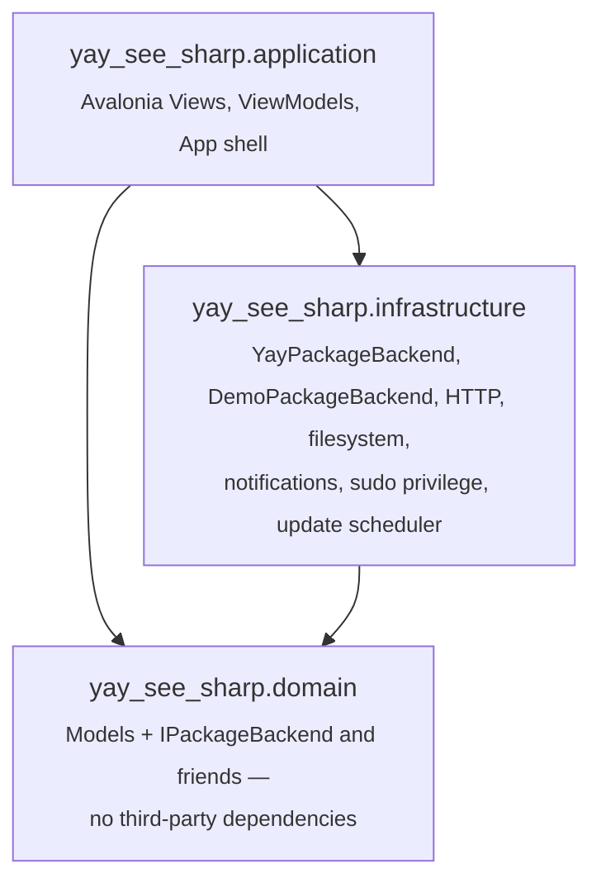

# Yay See Sharp


A fast, minimal desktop GUI for the [`yay`](https://github.com/Jguer/yay) / [`paru`](https://github.com/Morganamilo/paru) AUR helpers on Arch Linux and CachyOS — for people who want to search, install, update and remove packages without living in a terminal, and without a bloated package manager GUI getting in the way.

## Screenshots

<table>
  <tr>
    <td width="50%"><br/><sub align="center">Dashboard — stats and pending updates</sub></td>
    <td width="50%"><br/><sub>Search — Official/AUR filtering</sub></td>
  </tr>
  <tr>
    <td width="50%"><br/><sub>Installed packages</sub></td>
    <td width="50%"><br/><sub>Package detail — dependencies, PKGBUILD, uninstall</sub></td>
  </tr>
</table>


<sub>Settings — theme, language, update schedule, notifications</sub>

*Screenshots are rendered from the real, compiled application UI (Avalonia's headless platform, no display required) running against the built-in Demo backend — nothing here is mocked-up or hand-drawn.*

## Features

- **Search** the official repositories and the AUR side by side, filterable by source, with a visible loading indicator while searches are in flight
- **Install / uninstall / update** with live, streamed command output and a cancellable progress modal; failures show the actual error output, not just an exit code
- **Automatic backend detection** — real `yay`/`paru` on Arch Linux/CachyOS (the engine selected in Settings, verified on PATH), a realistic in-memory **Demo mode** everywhere else (safe to explore on any distro, never touches the host); on Arch/CachyOS *without* the selected engine, the app offers to install `yay` (or shows a clear warning for a missing `paru`) instead of silently pretending Real mode works; the Settings **Detect** button reports and applies what it actually found
- **Scheduled background update checks** with in-app notifications (OS-level notifications are opt-in via Settings — off by default, so one event never produces two popups)
- **In-app PKGBUILD viewer** — fetched straight from the AUR, no browser round-trip
- **Orphan cleanup** on uninstall, configurable as a default
- **Live localization in 11 languages** — English, Slovenčina, Deutsch, Polski, Русский, Español, Português, Italiano, 简体中文, 繁體中文 and 日本語; switch languages without restarting
- **System tray** integration — icon visible from startup, minimize-to-tray and close-to-tray
- **In-app toast notifications** for install/uninstall/update results and errors, auto-dismissing after 10s
- Secure privilege elevation via `sudo`, with the password never touching argv, logs, or disk

> **Future feature — AUR helper build directory:** a custom `--builddir` for `yay` install/update operations is modeled in the settings persistence layer (`SettingsViewModel.BuildDirectory`, `IBuildDirectoryPolicy`) and already wired into `YayPackageBackend`, but is **not exposed in the current UI** — there is no Settings screen control for it yet. It's always unset today and has no effect on install/update behavior.

## Requirements

- **OS:** Linux with an X11 or Wayland display session
- **Real mode:** Arch Linux or CachyOS, with the engine selected in Settings (`yay` or `paru`) installed on PATH
- **Demo mode:** any other Linux distribution (Ubuntu, Debian, Fedora, ...) — no AUR helper required
- **.NET runtime:** 10.0 or later

## Quick start

```bash
git clone https://github.com/StipecMV/yay_see_sharp.git
cd yay_see_sharp
dotnet build yay_see_sharp.slnx
dotnet run --project source/yay_see_sharp.application/yay_see_sharp.application.csproj
```

The active mode is detected automatically at startup: Arch Linux/CachyOS with the selected engine (`yay` or `paru`) on PATH runs in **Real mode**; everything else runs in **Demo mode** with simulated data.

> **Real mode status:** the Real backend (`YayPackageBackend`) was exercised on a live CachyOS desktop in August 2026 (install/uninstall/update flows, search, filters, settings) and the issues found there were fixed and covered by regression tests — see [`docs/bugfixes-2026-08.md`](docs/bugfixes-2026-08.md). It is still **not** verified in this repository's own CI (no Arch/CachyOS runner with real `yay` yet); anything that needs a real display session, a real D-Bus/notification daemon, a real system tray, or a real `sudo` prompt (tray icon behavior, OS-level desktop notifications, the interactive privilege-elevation dialog) is exercised only in Demo mode and headless E2E here — it requires manual verification on an actual Arch/CachyOS desktop before being trusted in production.

## Architecture

The application is split into three source assemblies with a strict, one-directional dependency graph:



- **`yay_see_sharp.domain`** — plain C# models and interfaces (`IPackageBackend`, `IPrivilegeService`, `INotificationService`, ...). No Avalonia, no platform-specific I/O, no NuGet dependencies beyond the BCL.
- **`yay_see_sharp.infrastructure`** — every concrete implementation: `YayPackageBackend` (wraps `yay`/`paru` via a controlled `ICommandRunner`, never a shell string — the same backend is parameterized by engine), `DemoPackageBackend`, HTTP/filesystem services, `sudo` elevation, the update scheduler, desktop notifications. No Avalonia dependency.
- **`yay_see_sharp.application`** — Avalonia Views, ViewModels, theming, and `AppBootstrapper` (the single composition root that wires real services together at startup).

The UI never shells out to `yay`, `pacman`, or any command directly — every package operation goes through `IPackageBackend`, so the same ViewModels drive both the real backend and the Demo backend identically.

See [`docs/architecture.md`](docs/architecture.md) for the full breakdown, [`docs/product-requirements.md`](docs/product-requirements.md) for the requirements, [`docs/aur-packaging-guide.md`](docs/aur-packaging-guide.md) for packaging on the AUR, and [`docs/bugfixes-2026-08.md`](docs/bugfixes-2026-08.md) for the 2026-08 bugfix round from live CachyOS feedback.

## Testing

Five TUnit test projects, each scoped to one architectural layer:

| Project | Command | What it covers |
| --- | --- | --- |
| `yay_see_sharp.domain.Tests` | `dotnet run --project tests/yay_see_sharp.domain.Tests` | Pure domain logic (e.g. `UpdateScheduleCalculator`). No mocks — the domain layer has nothing external to mock. |
| `yay_see_sharp.infrastructure.Tests` | `dotnet run --project tests/yay_see_sharp.infrastructure.Tests` | `YayPackageBackend`/`DemoPackageBackend` (incl. shared contract tests run against both), `SudoPrivilegeService`, notifications, `FolderBrowserService`, `PkgbuildService`. TUnit + Moq, mocked `ICommandRunner`/`HttpMessageHandler` — never a real `yay`. |
| `yay_see_sharp.application.Tests` | `dotnet run --project tests/yay_see_sharp.application.Tests` | Every ViewModel (Dashboard, Search, Installed, Settings, Package Details, PKGBUILD viewer, build job, auth prompt, folder browser) against the Demo backend and mocked services. |
| `yay_see_sharp.integration.Tests` | `dotnet run --project tests/yay_see_sharp.integration.Tests` | Real I/O: live AUR search, real PKGBUILD fetch, real filesystem/settings persistence, real streamed process output. Network-flaky tests skip gracefully; three destructive install/uninstall tests are gated behind `YAY_SEE_SHARP_RUN_ARCH_INTEGRATION_TESTS=1` and only run on a real Arch/CachyOS host with `yay`. |
| `yay_see_sharp.e2e.Tests` | `dotnet run --project tests/yay_see_sharp.e2e.Tests` | Avalonia Headless end-to-end: the real compiled Views + real ViewModels + real binding/styling pipeline, run without a display. Covers app launch, sidebar navigation, live language/theme switching, search results rendering, and dismissing the dashboard notification banner via a real simulated click. |

Run everything:

```bash
dotnet build yay_see_sharp.slnx
for p in domain infrastructure application integration e2e; do
  dotnet run --project tests/yay_see_sharp.$p.Tests
done
```

## Logging

The app writes a **log4net** log file for every run — no config file needed, the file appender is
configured in code at startup (`Program.Main`). Everything that matters for debugging goes there:
process start (version/OS/PID), backend selection, every `yay`/`pacman` command with exit code
and duration (plus the output tail on failure), settings load/save, language changes, package
operations (install/uninstall/update), PKGBUILD fetches, elevation outcomes, toasts, and
unhandled/unobserved exceptions. Splat/ReactiveUI internals are routed to the same file.

- **Location:** `~/.config/yay_see_sharp/logs/yay-see-sharp-<start>-<pid>.log` (same app-data
  directory as `settings.json`)
- **Rotation, per run:** one fresh file per run; at **10 MB** it rolls to a second segment
  (`<name>.1`); a run never holds more than two files — when a third segment would start, the
  oldest is deleted. Previous runs' files are left in place.
- **Level:** INFO by default (WARN/ERROR included); DEBUG messages exist in a few hot paths but
  are filtered out unless the root level is lowered.

## Contributing

Issues and pull requests are welcome. Please keep changes scoped to one architectural layer where possible (see [Architecture](#architecture)), add tests in the matching project from the table above, and make sure `dotnet build yay_see_sharp.slnx` stays clean before opening a PR.

## License

[GPL-3.0](LICENSE).
